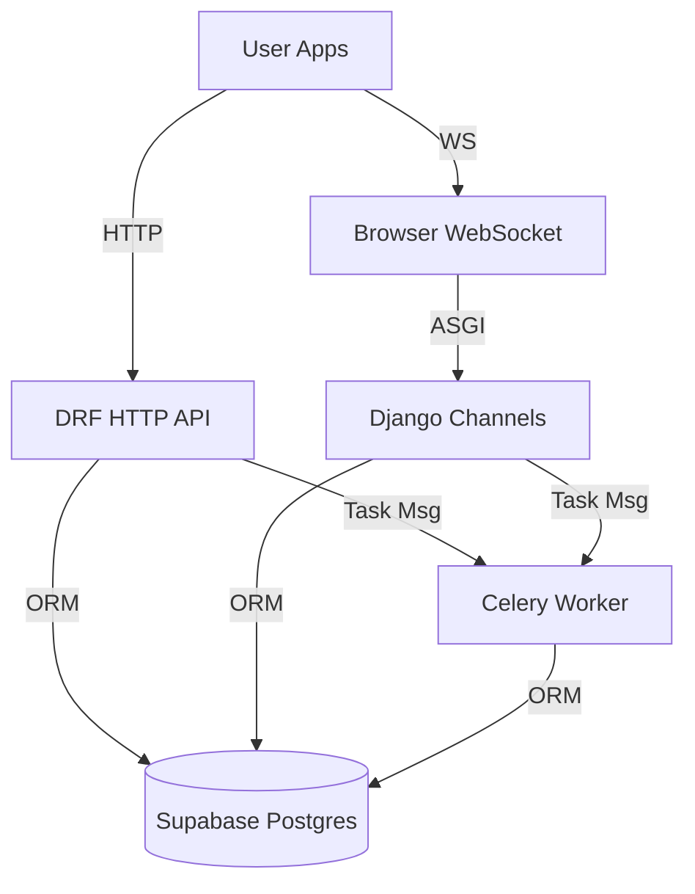

# System Architecture

## 1. High-Level Overview
The platform is a Django + Django REST Framework monolith backed by a Supabase-hosted Postgres database.

It exposes:

1. **REST API (HTTP/JSON)** — defined in `contract-api.md`
2. **WebSocket endpoints** (Django Channels) for live round draws, check-ins and the round timer
3. **Background workers** (Celery + Redis) for CPU-heavy or long-running jobs:
   * British Parliamentary (BP) draw generation
   * Break bracket generation
   * Standings recalculation

> Authentication is delegated to Supabase Auth (JWT). Row-level security is disabled; Django ORM is used with the JWT’s subject (`sub`) mapped to `users_user.id`.

## 2. Component Diagram (Mermaid)

## 3. Tenancy Strategy
Every domain table includes `tournament_id` (FK `tournaments.id`). Queries **must** always scope by it.

Endpoints therefore accept either:
* A URL parameter: `/api/tournaments/{id}/…`
* Or, for self-scoped resources, derive the ID from the user session.

## 4. Non-functional Goals
| Requirement | Target |
|-------------|--------|
| Latency (p95) | < 200 ms for simple GETs |
| Concurrency  | 1 000 simultaneous socket connections |
| Data size    | 10 k tournaments, 100 k rounds per DB | 

## 4. Key Design Decisions

Based on project requirements, the following architectural principles are established:

*   **Stateless API:** The backend is stateless. Authentication is handled via JWTs issued by Supabase Auth, eliminating server-side sessions and simplifying scalability.
*   **ORM as Primary Data Interface:** All database interactions must go through the Django ORM. This ensures a consistent data access layer and leverages Django's security features. Raw SQL is forbidden.
*   **Tabbycat Logic as a Blueprint:** The core tournament logic for British Parliamentary debates—including draw generation, break calculations, and scoring—is conceptually ported and adapted from Tabbycat.
*   **Strict Multi-Tenancy:** All tournament-specific data is isolated using a mandatory `tournament_id` foreign key on relevant tables. This is a hard requirement for data integrity.
*   **Targeted Real-Time Updates:** WebSockets (via Django Channels) are used exclusively for high-impact, real-time features: draw releases, participant check-ins, and the live round timer.
*   **No Vendor Lock-in (where practical):** Features like Supabase's Row Level Security (RLS) are disabled in favor of implementing authorization logic within the Django application. This provides greater control and portability.
*   **English as Standard:** All internal code, database schemas, and API resources will be in English to adhere to industry best practices. Localization, if needed, will occur at the presentation layer. 