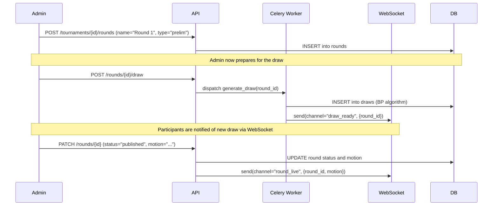
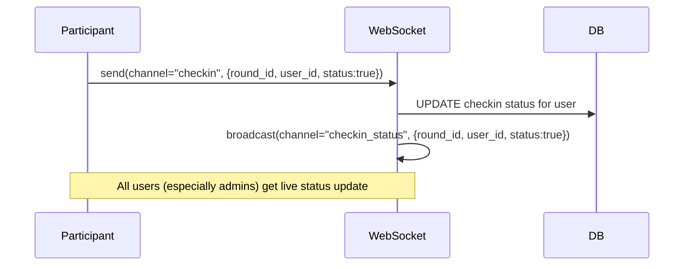
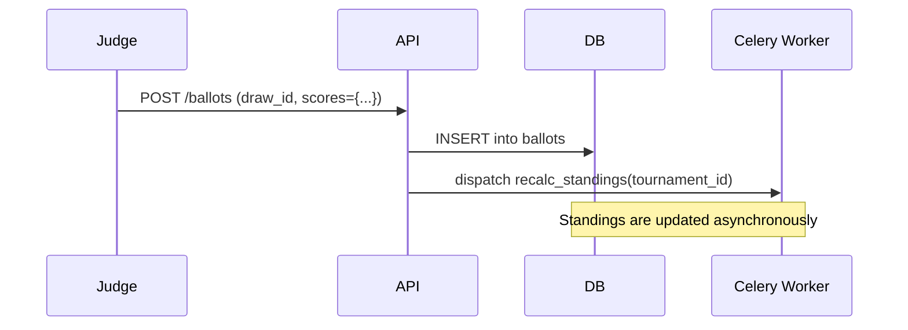

# Core Use Cases

This document describes the primary user stories and system flows.

## Legend
*   **A** = Admin / Tournament Organizer
*   **P** = Participant (Speaker or Judge)
*   **S** = System (Alegator Backend)
*   **API** = Django REST Framework API
*   **WS** = WebSocket (Django Channels)
*   **BG** = Background Worker (Celery)
*   **DB** = Database (Supabase/Postgres)

---

### UC-01: User Registration & Authentication
A user creates an account and logs in to receive an auth token.

1.  **P** `POST /auth/register` with email/password → **S** creates a user in Supabase Auth and a corresponding `users_user` profile record in the DB.
2.  **P** `POST /auth/login` with credentials → **S** validates against Supabase Auth and returns a JWT.

### UC-02: Tournament Creation & Setup
An admin creates and configures a new tournament.

1.  **A** `POST /tournaments` with tournament details → **API** saves the new tournament to the **DB**.
2.  **API** creates a `usertournament` record, assigning the creator the `admin` role for that tournament.
3.  **A** `POST /tournaments/{id}/teams` → **API** bulk-imports teams.
4.  **A** `POST /tournaments/{id}/adjudicators` → **API** bulk-imports adjudicators.

### UC-03: Round & Draw Lifecycle
An admin creates a round, generates the draw, and publishes it.

### UC-04: Participant Check-in
A participant marks themselves as present for a round.

### UC-05: Ballot Submission & Scoring
A judge submits scores for a completed debate.

### UC-06: View Standings
Any user views the current team and speaker rankings.

1.  **P/A** `GET /tournaments/{id}/standings` → **API** returns the latest cached standings.
2.  The `recalc_standings` Celery task (see UC-05) keeps this data fresh. After it runs, it can optionally push a `standings_update` event via WebSockets to notify active clients.

### UC-07: Break Generation
An admin closes preliminary rounds and generates the elimination rounds.

1.  **A** verifies all preliminary rounds are `completed` and ballots are in.
2.  **A** `POST /tournaments/{id}/break` → **API** dispatches a `generate_break(tournament_id)` task to a **BG** worker.
3.  **BG** calculates the break based on team standings and Tabbycat-default rules.
4.  **BG** creates new `rounds` with `type="break"` in the **DB**.
5.  **BG** notifies the admin of completion.

### UC-08: Adjudicator Feedback Submission
A team provides feedback on their adjudicators after a round.

1.  **P** (as team member) `POST /feedback` with scores/comments for an adjudicator and draw.
2.  **API** saves the feedback to the **DB**, associated with the adjudicator. This data can be used to adjust adjudicator scores over time. 